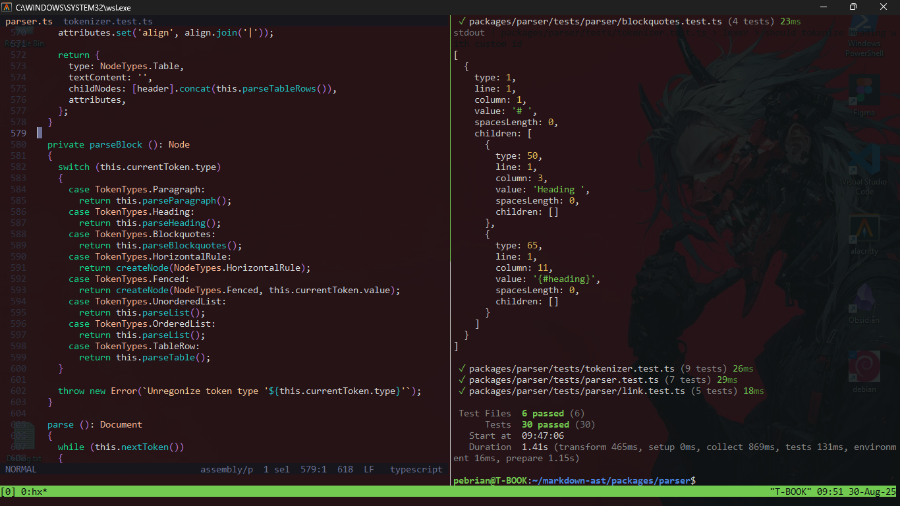

# Horizon Grove 🌿

*A calm, nature-inspired theme for the Helix editor.*

Horizon Grove is a serene, green-leaning theme adapted from **Horizon Cold** VSCode. Blending soft emerald and forest hues, it's designed for developers who prefer a nature-infused palette that's easy on the eyes.

---



---
<!--
## ✨ Features

* Nature-themed palette with rich green accents
* Balanced contrast for readability and low eye strain
* Supports a wide range of languages (Rust, TypeScript, HTML, etc.)
* Subtle blue-green tone switching for depth
---
-->

## 📦 Installation

1. Copy `horizon-grove.toml` into your Helix themes directory:

   ```sh
   mkdir -p ~/.config/helix/themes
   cp horizon-grove.toml ~/.config/helix/themes/
   ```

2. Edit your `~/.config/helix/config.toml` and set:

   ```toml
   theme = "horizon-grove"
   ```

---
<!--
## 🌲 Inspiration

* Based on the original [Horizon theme]()
* Forests, moss, groves, and the calm tones of nature

---

## 🖼 Preview

> Add a screenshot of your theme in action and name it `screenshot.png` in the root of the repo.

---
-->
## 📜 License

MIT License © 2025 Pebrian
